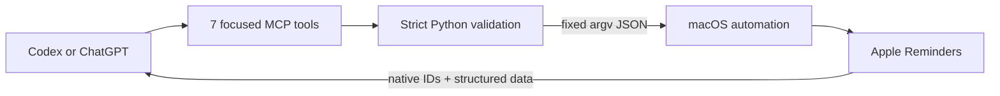

<p align="center">
  
</p>

<h1 align="center">Apple Reminders MCP</h1>

<p align="center"><strong>Tell your AI. It’s on your list.</strong></p>

<p align="center">
  <a href="https://github.com/henryvn27/apple-reminders-mcp/actions/workflows/ci.yml"></a>
  <a href="LICENSE"></a>
  
  
</p>

A tiny, local-first MCP plugin that lets Codex or ChatGPT work with the
Reminders app already on your Mac.

```text
You: What school reminders are still open?
AI: You have 3 open reminders in School.

You: Move “submit the form” to Personal and mark it high priority.
AI: Updated “Submit the form”.
```

Read it. Add it. Change it. Finish it. No cloud database, replacement task app,
or dependency install.

## Install in Codex

```bash
codex plugin marketplace add henryvn27/apple-reminders-mcp
codex plugin add apple-reminders@apple-reminders-mcp
```

Start a new Codex task after installation, then ask naturally:

```text
What reminders are due in my School list?
Remind me next Friday at 3 PM to send the Scoutly build.
Change my “send the build” reminder to high priority.
Mark “bring goggles” complete.
Reopen the goggles reminder.
Delete the old domain-renewal reminder.
```

macOS may ask whether Codex or Python can control Reminders on first use.
Choose **Allow**. The permission and your reminder data stay on your Mac.

## What it can do

| Tool | What it does | Safety |
| --- | --- | --- |
| `list_reminder_lists` | Lists native lists, IDs, and counts | Read-only |
| `search_reminders` | Searches titles and notes; filters by list and completion | Read-only |
| `get_reminder` | Reads one reminder by exact native ID | Read-only |
| `add_reminder` | Creates one reminder | One item |
| `update_reminder` | Edits title, notes, due value, priority, or list | Exact ID |
| `set_reminder_completed` | Completes or reopens one reminder | Exact ID |
| `delete_reminder` | Permanently deletes one reminder | Exact ID; destructive |

The plugin exposes no bulk delete and no list delete. Compatible MCP clients
receive accurate read-only, idempotent, and destructive annotations.

Dates support all-day `YYYY-MM-DD` values and timed ISO 8601 values with an
explicit UTC offset. An existing due value can change within the same all-day
or timed kind. Cross-kind changes are rejected because the native scripting
interface can leave stale date state.

## How it works



The MCP server uses only Python's standard library and a fixed JavaScript for
Automation bridge. User content is serialized as JSON in a separate process
argument—never interpolated into shell commands or executable source.

Exact-item actions use Reminders' direct `byId(...)` specifier rather than
enumerating the full reminder library.

## ChatGPT

ChatGPT cannot call a local stdio MCP process directly. OpenAI's
[Secure MCP Tunnel](https://developers.openai.com/api/docs/guides/secure-mcp-tunnels)
can expose this server through an outbound-only connection when your plan and
workspace support developer-mode MCP actions.

```bash
export CONTROL_PLANE_API_KEY="<runtime API key>"
tunnel-client init \
  --sample sample_mcp_stdio_local \
  --profile apple-reminders \
  --tunnel-id "<tunnel_id>" \
  --mcp-command "/usr/bin/python3 /absolute/path/to/apple-reminders-mcp/plugins/apple-reminders/server.py"
tunnel-client doctor --profile apple-reminders --explain
tunnel-client run --profile apple-reminders
```

Never commit the runtime API key or tunnel profile. See OpenAI's
[current full-MCP availability](https://help.openai.com/en/articles/12584461-developer-mode-and-full-mcp-connectors-in-chatgpt)
before setup.

## Develop

```bash
cd plugins/apple-reminders
/usr/bin/python3 -m unittest discover -s tests -v
python3 -m py_compile server.py
osacompile -l JavaScript -o /tmp/apple-reminders.scpt reminders.js
```

Automated tests never access Reminders. Live mutations happen only through
`tools/call`.

## Security

Please report vulnerabilities through
[GitHub private vulnerability reporting](https://github.com/henryvn27/apple-reminders-mcp/security/advisories/new).
The full boundary is documented in [SECURITY.md](SECURITY.md).

## License

MIT © Henry Van Ness

Apple and Reminders are trademarks of Apple Inc. This project is independent
and is not affiliated with or endorsed by Apple.
